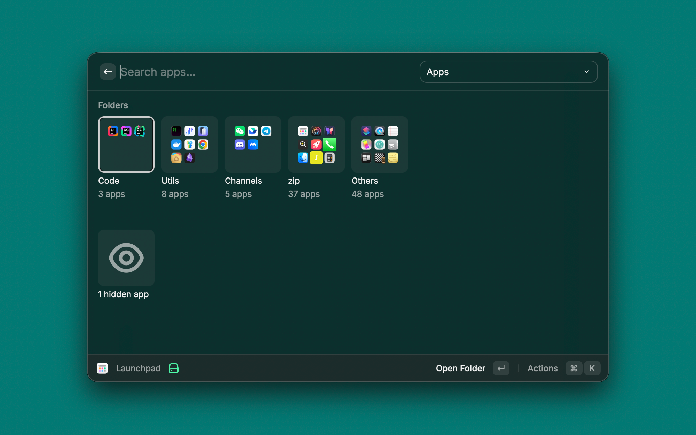
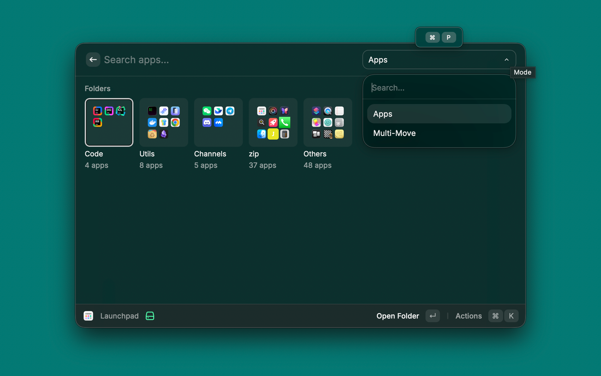
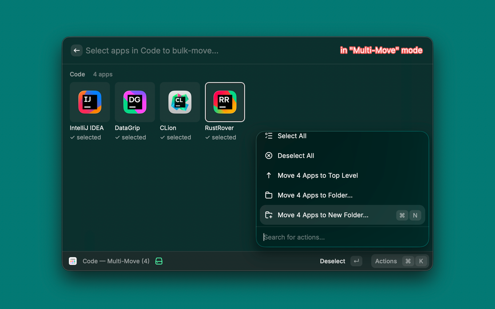

# Launchpad for Raycast

A Raycast extension replacing macOS Launchpad (removed in macOS 26 Tahoe). Browse and launch your installed apps in a grid, organized into user-defined folders that are imported from your existing Launchpad layout on first run.

| Top-level grid | Mode dropdown | Multi-Move inside a folder |
| --- | --- | --- |
|  |  |  |

## Features

- **Imports your old Launchpad layout** — folders, names, ordering. Reads the macOS Launchpad SQLite DB on first launch.
- **Folders** — create, rename, delete, reorder. Cells show a composite 3×3 preview of up to 9 contained app icons.
- **Hide apps** you never use. Hidden apps are kept around (not just bundleIds) so unhide restores name and path without a re-scan.
- **Multi-Move** — bulk-select apps inside a folder or in the uncategorized bucket and move them all to a folder, top level, or a new folder.
- **Localized names** via Spotlight metadata — "密码", "Karten", "Réglages système" etc. instead of always-English bundle names.
- **Auto-sync** — newly-installed apps land at the start of the uncategorized bucket the next time you open the extension. Uninstalled apps are dropped from folders automatically.

## Install

### From source (until published to the Raycast Store)

```bash
git clone https://github.com/alsmjs/raycast-ext-launchpad.git
cd raycast-ext-launchpad
npm install
npm run dev
```

`npm run dev` requires Raycast to be running. It imports the extension into Raycast and enables hot-reload. Stop with `Ctrl+C` — the extension stays installed.

To produce a build for the Raycast Store: `npm run build`.

## Usage

Open Raycast and type `launchpad` (or your configured alias).

### Modes

A dropdown in the search bar toggles between two modes:

- **Apps** — single-app actions on the highlighted item.
- **Multi-Move** — bulk-select apps to move them in one go. Selection is scoped to one bucket: either the uncategorized list **or** one specific folder. Switching scope clears the selection.

### Keyboard shortcuts

| Shortcut | Action |
| --- | --- |
| `Enter` | Open app / open folder |
| `Cmd + N` | Create a new folder |
| `Cmd + R` | Rename folder |
| `Ctrl + X` | Delete folder (apps inside flow back to top level) |
| `Opt + Shift + ←` / `→` | Move highlighted folder or app left / right |
| (Action panel) | Hide app, Move to Folder, Move to Top Level |

In Multi-Move:

| Shortcut | Action |
| --- | --- |
| `Enter` | Toggle selection on highlighted app, or open a folder to select inside it |
| `Cmd + Enter` | Done — exit Multi-Move |
| `Cmd + N` | Move selected apps to a new folder |

### Hidden apps

Hiding an app removes it from the grid but keeps it in your config. A "N hidden apps" cell appears under the main grid when there are any. Its only action is **Unhide All** — there's no per-app unhide UI on purpose, since the bucket is intended as an escape hatch for clutter you rarely revisit.

## How import works

On first launch the extension reads the macOS Launchpad DB at `/private${getconf DARWIN_USER_DIR}com.apple.dock.launchpad/db/db` via the `sqlite3` CLI and reconstructs your folder layout. System-internal groups (`Root`, `HoldingPage`, `Default`) are filtered out — only your user folders are imported. If the DB is missing or its schema has changed, the extension falls back to a flat uncategorized list of every app `getApplications()` returns.

After first launch the layout lives in Raycast's `LocalStorage`. The macOS DB is never written to.

## Constraints

- **Grid columns** are fixed at 8 (the maximum Raycast's `Grid` supports).
- **No drag-and-drop** — Raycast's Grid API doesn't expose it. Reorder via the action panel or the arrow shortcuts above.
- **No in-extension search bar logic** — Raycast's native search filters items by title automatically.

## Architecture

For implementation notes (data flow, two-phase load, sync icon rebuild discipline, schema of the imported Launchpad DB), see [CLAUDE.md](./CLAUDE.md).

## License

[MIT](./LICENSE)
